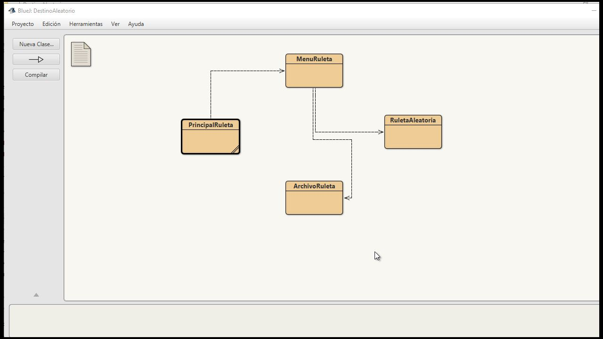

# 🎯 Destino Aleatorio

Una aplicación de ruleta de nombres desarrollada en **Java** utilizando **BlueJ**.  
Permite cargar nombres, hacer sorteos, guardar listas en archivos `.txt` y vincula programación con creatividad artística. Ideal para sorteos, desafíos o actividades lúdicas.

---

## 📸 Vista previa del programa

> _Interfaz de consola y funcionamiento básico_

  
  

---

## 🧠 Tecnologías y herramientas

- Java (JDK 17+)
- BlueJ
- Paradigma: Programación Orientada a Objetos (POO)
- Archivos `.txt` para almacenamiento

---

## 🧩 Estructura del proyecto

El proyecto está dividido en **clases con responsabilidades claras**, siguiendo buenas prácticas de diseño POO:

| Clase               | Responsabilidad principal                                                                 |
|---------------------|--------------------------------------------------------------------------------------------|
| `PrincipalRuleta`   | Contiene el método `main` e inicia la ejecución del programa desde consola                |
| `MenuRuleta`        | Muestra el menú interactivo, gestiona la entrada del usuario y el flujo del programa      |
| `RuletaAleatoria`   | Lógica principal de la ruleta: agregar nombres, eliminar, girar aleatoriamente, validar   |
| `ArchivoRuleta`     | Manejo de archivos `.txt`: guardar listas, cargar, eliminar archivos, confirmar acciones  |

---

## 🧪 Funcionalidades

✅ Agregar nombres a la lista  
✅ Eliminar nombres específicos  
✅ Girar la ruleta de forma aleatoria  
✅ Mostrar todos los nombres cargados  
✅ Contar cuántos nombres hay en la lista  
✅ Evitar duplicados  
✅ Guardar y cargar listas de nombres desde archivos `.txt`  
✅ Confirmaciones antes de sobrescribir o borrar archivos  

---

## 🔍 ¿Por qué este proyecto?

- 🧠 Aplicación de conceptos clave de **POO**
- 📚 Proyecto desarrollado 100% en **BlueJ** con fines educativos
- 🎨 Vincula programación con creatividad artística (pensado para usar en sorteos de mi emprendimiento)
- 🚀 Demuestra progresos concretos como desarrollador

---

## 📂 Cómo ejecutar

1. Clonar o descargar este repositorio
2. Abrir el proyecto en **BlueJ**
3. Ejecutar la clase `PrincipalRuleta`
4. Seguir el menú desde consola

---

## 🖼️ Imágenes adicionales del código

  
  
  
  

---

## 👤 Autor

**Ivo Mirko Elian Narváez**  
📧 ivomirkoelian22@gmail.com

---

## 🏷️ Etiquetas

`#Java` `#BlueJ` `#POO` `#Consola` `#ProyectoEducativo` `#Ruleta` `#Sorteo` `#ArtCoding`

---
